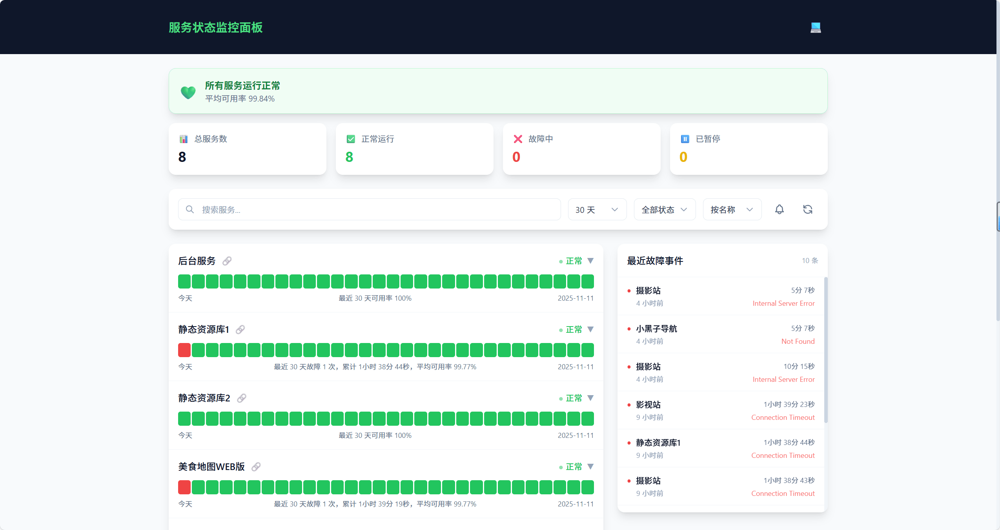

# Service Status Monitor

[中文文档](./README.md) | English

A modern service status monitoring panel based on UptimeRobot API.

Demo: https://lyhxx.github.io/uptime-status



## Features

- 🚀 **Modern Tech Stack** - Vite + React 18 + TypeScript + TailwindCSS
- 📊 **Data Visualization** - Uptime trend charts, response time graphs (dynamic Y-axis)
- 🔔 **Real-time Notifications** - Browser notifications (toggleable), page title status
- 🌓 **Theme Switching** - Dark/Light/System modes
- 📱 **Responsive Design** - Perfect mobile adaptation
- 🔍 **Search & Filter** - Search by name, filter by status (including paused), multiple sorting options
- 📅 **Time Range** - Support 30/60/90 days
- 📋 **Incident History** - Recent incidents with reasons
- 🖼️ **Embed Mode** - Support iframe embedding
- 📲 **PWA Support** - Add to home screen
- 🔤 **Font Adaptation** - Auto-adapt to platform fonts
- 📈 **Visit Statistics** - Integrated Busuanzi analytics
- ♿ **Accessibility** - Keyboard navigation, screen reader support, skip links
- 🔄 **Smart Refresh** - Last update time, loading state, auto retry

## Quick Start

### GitHub Pages Deployment

1. Fork this repository
2. Modify `base` and `siteUrl` in `site.config.ts`
3. Modify other settings in `src/config/config.ts`
4. Push code, GitHub Actions will auto build and deploy
5. Enable GitHub Pages in Settings → Pages, select "GitHub Actions" as source

### Local Development

```bash
# Install dependencies
npm install

# Start dev server
npm run dev

# Build for production
npm run build
```

## Get API Key

1. Register at [UptimeRobot](https://uptimerobot.com/)
2. Add websites/services to monitor
3. Go to **My Settings** page
4. Find **API Settings** section
5. Click **Create Read-only API Key**
6. Copy the generated key (starts with `ur`)

> Note: Use Read-only API Key, not Main API Key, to prevent malicious operations if leaked.


## Configuration

### Site Config (site.config.ts)

```typescript
export default {
  // Deployment path
  // For GitHub Pages subdirectory, use repo name like '/uptime-status/'
  // For custom domain or root path, use '/'
  base: '/uptime-status/',

  // Site URL (for SEO)
  siteUrl: 'https://lyhxx.github.io/uptime-status',
};
```

### App Config (src/config/config.ts)

```typescript
const config: AppConfig = {
  // Site title
  siteName: 'Service Status Monitor',

  // Site description (for SEO)
  siteDescription: 'Real-time service status monitoring',

  // Site keywords (for SEO)
  siteKeywords: 'service monitor,status page,UptimeRobot,uptime',

  // UptimeRobot API Keys
  apiKeys: ['your-api-key'],

  // Custom API proxy URL (optional, for CORS)
  apiUrl: '',

  // Default days to display (30, 60, 90)
  countDays: 30,

  // Show site links
  showLink: true,

  // Default theme ('light' | 'dark' | 'system')
  defaultTheme: 'system',

  // Default sort ('name' | 'status' | 'uptime')
  defaultSort: 'name',

  // Default filter ('all' | 'ok' | 'down' | 'paused')
  defaultFilter: 'all',

  // Auto refresh interval (seconds)
  refetchInterval: 300,

  // Data stale time (seconds)
  staleTime: 120,

  // Cache time (seconds)
  cacheTime: 600,
};
```

## Embed Mode

Add `?embed=1` parameter to URL for minimal embed mode:

```html
<iframe src="https://lyhxx.github.io/uptime-status/?embed=1" width="100%" height="600"></iframe>
```

## API Proxy

Due to browser CORS restrictions, direct UptimeRobot API calls will fail. You need a proxy.

### Nginx Proxy (Recommended)

```nginx
location /api/uptimerobot/ {
  proxy_pass https://api.uptimerobot.com/;
  proxy_ssl_server_name on;

  proxy_hide_header Access-Control-Allow-Origin;
  proxy_hide_header Access-Control-Allow-Methods;
  proxy_hide_header Access-Control-Allow-Headers;

  add_header Access-Control-Allow-Origin * always;
  add_header Access-Control-Allow-Methods 'GET, POST, OPTIONS' always;
  add_header Access-Control-Allow-Headers 'Content-Type' always;

  if ($request_method = 'OPTIONS') {
    return 204;
  }
}
```

### Cloudflare Worker

If you don't have a server, use Cloudflare Worker:

1. Login to [Cloudflare Dashboard](https://dash.cloudflare.com/)
2. Go to Workers & Pages → Create Worker
3. Paste content from `worker/uptimerobot-proxy.js`
4. Deploy and get Worker URL (e.g., `https://your-worker.workers.dev`)
5. Set `apiUrl: 'https://your-worker.workers.dev/v2/getMonitors'` in config

## Tech Stack

- [Vite](https://vitejs.dev/) - Build tool
- [React 18](https://react.dev/) - UI framework
- [TypeScript](https://www.typescriptlang.org/) - Type safety
- [TailwindCSS](https://tailwindcss.com/) - CSS framework
- [TanStack Query](https://tanstack.com/query) - Data fetching
- [Zustand](https://zustand-demo.pmnd.rs/) - State management
- [Recharts](https://recharts.org/) - Charts

## Custom Domain (Optional)

To use a custom domain:

1. Add CNAME record pointing to `<username>.github.io`
2. Set custom domain in Settings → Pages → Custom domain
3. Change `base` to `/` and `siteUrl` to your domain in `site.config.ts`

## FAQ

**Q: Page shows "Failed to load data"?**

A: Usually a CORS issue. Configure API proxy as described above.

**Q: Data not updating?**

A: Default refresh is 5 minutes. Adjust `refetchInterval` in config. UptimeRobot free tier also checks every 5 minutes.

**Q: How to monitor multiple accounts?**

A: Add multiple API Keys to `apiKeys` array. Data will be merged automatically.

**Q: How to hide certain monitors?**

A: Create Monitor-Specific API Key in UptimeRobot dashboard. It will only return that monitor's data.

**Q: How to disable browser notifications?**

A: Click the notification icon in toolbar to toggle. Settings are saved automatically.

**Q: Page shows "Please configure API Key"?**

A: Configure a valid UptimeRobot API Key in `src/config/config.ts`.

## License

MIT
